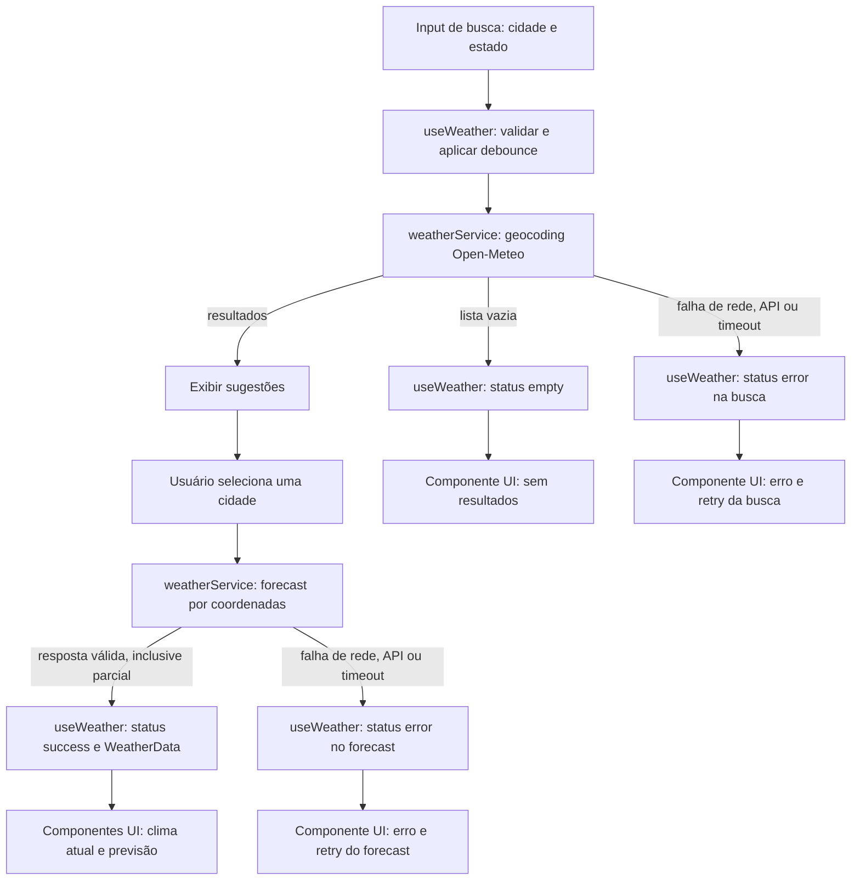

# Plano Técnico: Aplicação de Previsão do Tempo

Este plano deriva de `specs/weather-app-spec.md`. Ele define arquitetura, decisões e contratos para atender RF-01 a RF-08 e RNF-01 a RNF-07; não é a implementação final.

## Architecture

Aplicação SPA com fluxo unidirecional: `App` compõe a tela, a apresentação emite ações, o hook orquestra essas ações e chama o serviço, e os dados normalizados retornam à UI. As dependências seguem para dentro: componentes não chamam APIs e serviços não dependem de React.

- **Apresentação (`components/`)**: busca, sugestões, clima atual, previsão, seletor de unidade e estados visuais acessíveis. Recebe valores e callbacks por props; não mantém regras de integração.
- **Orquestração e estado (`hooks/`)**: `useWeather` coordena consulta, seleção, carregamento, erro, retry e descarte de respostas obsoletas. A unidade e sua persistência local são estado de interface, sem misturá-las ao estado meteorológico.
- **Acesso a dados (`services/`)**: `weatherService` forma as requisições, aplica timeout/cancelamento e traduz respostas Open-Meteo para os modelos internos. Não conhece componentes nem estado React.
- **Funções puras (`lib/`)**: conversão C/F, normalização de texto para comparar região e formatação de datas/códigos. Recebem valores e retornam resultados sem rede, DOM ou estado global.
- **Contratos (`types/`)**: tipos compartilhados para cidade, condições, previsão e unidade, além das formas normalizadas trocadas entre as camadas.

Essa separação permite testar `lib/` diretamente com entradas e saídas conhecidas, testar `services/` com `fetch` simulado, testar o hook isoladamente substituindo o serviço, e testar componentes por props e interações acessíveis. Playwright cobre apenas os fluxos integrados e a ligação real entre camadas. A cidade acompanha cada `WeatherData`, evitando atribuir respostas antigas à seleção atual. Atende principalmente RF-01–RF-08 e RNF-04–RNF-06.

## Tech Stack

| Camada | Tecnologia | Decisão |
| --- | --- | --- |
| Linguagem | TypeScript strict | Contratos explícitos para dados externos, inclusive campos opcionais. |
| UI e build | React + Vite | Mantém a SPA pequena e usa a stack existente. |
| Estilo | Tailwind CSS | Segue a stack e o tema definidos pelo projeto; garantir responsividade e foco visível. |
| Testes unitários | Vitest + Testing Library | Testar funções, serviços e estados da UI sem dependências de rede. |
| Testes E2E | Playwright | Verificar o fluxo integrado e o uso em viewport móvel. |
| Dados | Open-Meteo Geocoding e Forecast | Geocodificação e meteorologia sem chave de API (RNF-06). |
| Persistência | `localStorage` | Guardar somente a unidade preferida no navegador (RF-07, RNF-07). |

Não adicionar biblioteca de estado, cliente HTTP ou armazenamento externo: o escopo de uma cidade por vez não justifica essas dependências.

## Project Structure

```text
src/
├── components/
│   ├── SearchBar.tsx
│   ├── CitySuggestions.tsx
│   ├── CurrentWeather.tsx
│   ├── ForecastList.tsx
│   ├── ForecastDay.tsx
│   ├── UnitToggle.tsx
│   └── states/                 # loading, erro, vazio e dados parciais
├── hooks/
│   ├── useWeather.ts           # busca, seleção e ciclo da consulta
│   └── useUnitPreference.ts    # unidade e persistência local
├── services/
│   └── weatherService.ts      # clientes Open-Meteo e mapeamento das respostas
├── lib/
│   ├── temperature.ts         # conversão C/F
│   ├── weatherCodes.ts        # código WMO para metadados de apresentação
│   └── format.ts              # datas e normalização de texto
├── types/
│   └── weather.ts             # contratos internos compartilhados
└── App.tsx
```

Manter cada componente em seu próprio arquivo e concentrar chamadas externas em `services/`. `App.tsx` apenas conecta os hooks à composição da tela; não deve virar um segundo serviço ou concentrar regras de domínio. Os nomes ilustram responsabilidades propostas; a implementação deve seguir a convenção de testes já existente no repositório.

## Data Model

Contratos internos propostos (não incluem o formato integral das respostas externas):

```ts
export type Unit = 'celsius' | 'fahrenheit';

export interface City {
  id: number; // Identificador da localidade no geocoding.
  name: string; // Nome da cidade retornado pela Open-Meteo.
  admin1?: string; // Estado ou região administrativa, quando disponível.
  country: string; // País da localidade.
  countryCode?: string; // Código ISO do país, quando disponível.
  latitude: number; // Latitude usada na consulta de previsão.
  longitude: number; // Longitude usada na consulta de previsão.
  timezone?: string; // Fuso horário IANA retornado pelo geocoding.
}

export interface CurrentWeather {
  time?: string; // Horário local da observação atual.
  temperatureC?: number; // temperature_2m em graus Celsius.
  apparentTemperatureC?: number; // apparent_temperature em graus Celsius.
  relativeHumidityPercent?: number; // relative_humidity_2m em porcentagem.
  windSpeedKmh?: number; // wind_speed_10m em km/h, unidade padrão da API.
  weatherCode?: number; // weather_code WMO para as condições atuais.
}

export interface ForecastDay {
  date: string; // Data local YYYY-MM-DD fornecida em daily.time.
  minimumC?: number; // temperature_2m_min em graus Celsius.
  maximumC?: number; // temperature_2m_max em graus Celsius.
  weatherCode?: number; // weather_code WMO para o período diário.
  precipitationProbabilityPercent?: number; // precipitation_probability_max em porcentagem.
}

export interface WeatherData {
  city: City; // Localidade selecionada à qual os dados pertencem.
  current?: CurrentWeather; // Dados atuais recebidos; ausente se indisponíveis.
  forecast: ForecastDay[]; // Dias retornados; valores meteorológicos podem faltar.
}
```

Temperaturas normalizadas são mantidas em Celsius, solicitando essa unidade à API; valores ausentes permanecem ausentes, nunca substituídos por zero ou outro valor inventado (AC-08.3). Velocidade do vento usa km/h, unidade padrão da Open-Meteo. No limite de apresentação, converter somente temperaturas numéricas disponíveis. Os campos opcionais representam variáveis que a API pode omitir ou que não foram definidas como obrigatórias pela spec.

## Data Flow



1. A pessoa informa cidade e estado. Entrada em branco ou só espaços é rejeitada localmente, sem requisição (AC-01.2).
2. O hook agenda a busca de sugestões durante a digitação, com debounce curto (por exemplo, 300 ms), cancela ou ignora respostas antigas e passa os termos ao `weatherService`.
3. O serviço consulta geocodificação pelo nome da cidade. Se fornecido, o estado é usado para filtrar candidatos por `admin1`, sem diferenciar maiúsculas/minúsculas e tolerando acentos. As sugestões exibem cidade, estado/região e país, quando disponíveis, para distinguir homônimos (RF-02, RF-03).
4. Uma busca sem correspondências mostra estado vazio e não inicia consulta meteorológica (AC-08.1).
5. Ao selecionar uma sugestão, o hook mantém a `City` selecionada e solicita previsão por latitude/longitude. Uma nova seleção invalida resultados pendentes da cidade anterior.
6. O serviço mapeia resposta atual e séries diárias para `WeatherData`; a UI apresenta os dados recebidos, a cidade e os campos ausentes como indisponíveis.
7. O seletor deriva os valores exibidos em Celsius ou Fahrenheit. A alteração não refaz a consulta meteorológica. A unidade escolhida é persistida no navegador.

## External APIs

**Geocoding — Open-Meteo**

```text
GET https://geocoding-api.open-meteo.com/v1/search?name={cidade}&count=10&language=pt&format=json
```

Parâmetros: `name` é obrigatório e recebe o nome da cidade; `count` limita sugestões; `language=pt` localiza nomes quando disponíveis; `format=json` define a resposta. A API pesquisa pelo nome, portanto o estado digitado é refinamento local de `admin1`, não um parâmetro separado.

Exemplo resumido de resposta:

```json
{
  "results": [
    {
      "id": 3448439,
      "name": "São Paulo",
      "latitude": -23.5475,
      "longitude": -46.6361,
      "country": "Brasil",
      "country_code": "BR",
      "admin1": "São Paulo",
      "timezone": "America/Sao_Paulo"
    }
  ]
}
```

Mapeamento: cada item de `results` vira um `City`: `id`, `name`, `admin1`, `country`, `country_code` → `countryCode`, `latitude`, `longitude` e `timezone`. `admin1`, `country_code` e `timezone` podem não existir em toda resposta; manter os campos correspondentes opcionais. Se `results` estiver ausente ou vazio, tratar como nenhuma correspondência. Usar `URLSearchParams` para codificar os valores e ajustar `count` caso os testes revelem que o refinamento local omite resultados válidos.

**Forecast — Open-Meteo**

```text
GET https://api.open-meteo.com/v1/forecast?latitude={latitude}&longitude={longitude}&current=temperature_2m,apparent_temperature,relative_humidity_2m,wind_speed_10m,weather_code&daily=weather_code,temperature_2m_max,temperature_2m_min,precipitation_probability_max&forecast_days=5&timezone=auto&temperature_unit=celsius
```

Parâmetros: `latitude` e `longitude` identificam a cidade selecionada; `current` solicita variáveis meteorológicas atuais; `daily` solicita variáveis de previsão por dia; `forecast_days=5` pede hoje e os quatro dias seguintes; `timezone=auto` usa o fuso da coordenada; `temperature_unit=celsius` mantém temperaturas normalizadas em Celsius. As temperaturas são retornadas em °C e `wind_speed_10m` usa km/h por padrão.

Exemplo resumido de resposta:

```json
{
  "latitude": -23.5,
  "longitude": -46.6,
  "timezone": "America/Sao_Paulo",
  "current": {
    "time": "2026-09-30T14:00",
    "temperature_2m": 21.4,
    "apparent_temperature": 22.1,
    "relative_humidity_2m": 68,
    "wind_speed_10m": 12.3,
    "weather_code": 2
  },
  "daily": {
    "time": ["2026-09-30", "2026-10-01", "2026-10-02", "2026-10-03", "2026-10-04"],
    "temperature_2m_min": [16.2, 17.0, 18.1, 17.5, 16.8],
    "temperature_2m_max": [25.0, 26.1, 27.3, 24.8, 23.9],
    "weather_code": [2, 3, 1, 61, 2],
    "precipitation_probability_max": [10, 15, 5, 70, 20]
  }
}
```

Mapeamento para os modelos: `current.time` → `CurrentWeather.time`; `temperature_2m` → `temperatureC`; `apparent_temperature` → `apparentTemperatureC`; `relative_humidity_2m` → `relativeHumidityPercent`; `wind_speed_10m` → `windSpeedKmh`; `weather_code` → `weatherCode`. Para `daily`, parear os arrays pelo mesmo índice e criar um `ForecastDay` por data: `time[i]` → `date`, `temperature_2m_min[i]` → `minimumC`, `temperature_2m_max[i]` → `maximumC`, `weather_code[i]` → `weatherCode` e `precipitation_probability_max[i]` → `precipitationProbabilityPercent`. O `WeatherData` final associa esses dados à `City` selecionada; o fuso retornado valida a interpretação das datas locais. Verificar arrays e valores antes do mapeamento; variável ausente vira propriedade ausente, nunca um valor inventado (AC-08.3). As respostas reais também incluem metadados de unidade, que devem ser usados para validar as unidades esperadas.

## State Management

O estado de consulta vive no hook `useWeather`; não é necessário gerenciador global para o fluxo de uma cidade por vez. O hook mantém busca, sugestões, cidade selecionada, dados meteorológicos, erro e dados necessários para retry. O ciclo usa estes estados explícitos:

- `idle`: ainda não há busca ou cidade selecionada.
- `loading`: busca de cidade ou consulta de forecast em andamento. Um campo `operation: 'search' | 'weather'` identifica qual delas está carregando.
- `success`: busca concluída com sugestões ou forecast carregado; `operation` e os dados associados indicam qual resultado está disponível.
- `empty`: busca válida concluída sem cidades correspondentes; não há sugestões nem consulta de forecast.
- `error`: busca ou forecast falhou; o contexto da operação e uma mensagem recuperável permitem apresentar o aviso e oferecer retry.

`Unit` é estado independente, mantido por `useUnitPreference`. Inicializar lendo `localStorage`, aceitar apenas `celsius` ou `fahrenheit` e usar Celsius na ausência de preferência ou diante de valor inválido. Gravar após mudança; proteger leitura e escrita contra indisponibilidade do armazenamento. Não persistir cidade nem dados meteorológicos.

Os dados internos permanecem em Celsius. Na renderização, converter cada temperatura disponível para a unidade selecionada pela fórmula `°F = °C × 9/5 + 32`; para Celsius, manter o valor original. A conversão é derivada e não altera o estado nem dispara novo request. Exibir sempre o símbolo/unidade correspondente e não tentar converter campos ausentes.

Ao iniciar nova busca ou selecionar outra cidade, cancelar a requisição anterior com `AbortController` ou ignorar sua resposta por identificador. Limpar ou ocultar o forecast anterior até que os dados da cidade atualmente selecionada estejam disponíveis, evitando atribuição incorreta.

## Error Handling

- **Entrada inválida:** validar cidade e estado antes do serviço; informar em pt-BR e manter a consulta em `idle`, sem enviar request.
- **Sem resultados:** resposta válida de geocoding com `results` vazio leva a `empty`, não a `error`; não solicitar forecast e manter busca disponível.
- **Falha de rede:** rejeição de `fetch` ou falta de conectividade leva a `error`, com aviso de indisponibilidade e retry da operação que falhou.
- **Falha da API:** resposta HTTP não bem-sucedida, JSON inválido ou estrutura incompatível deve ser tratada como `error`, distinta de uma lista válida sem resultados. Não apresentar conteúdo da resposta como dado meteorológico confirmado.
- **Timeout:** usar `AbortController` com limite inicial configurável de 10 segundos; tratar timeout como erro recuperável, encerrar `loading` e oferecer retry. O limite é provisório, pois a spec ainda deixa esse valor em aberto. Cancelamentos causados por uma busca/seleção mais recente não devem gerar aviso de erro.
- **Erro no forecast:** preservar a cidade selecionada para contextualizar o aviso e retry; não mostrar os dados da cidade anterior como se fossem atuais.
- **Resposta parcial:** validar variáveis e arrays diários independentemente. Preservar campos recebidos; representar campos indisponíveis como ausentes no modelo e indicá-los na UI, sem inventar valores. Dados atuais ausentes não impedem exibir uma previsão válida, e vice-versa (AC-08.3).
- **Unidade persistida inválida ou armazenamento bloqueado:** usar Celsius inicialmente ou manter a seleção em memória; não interromper busca nem forecast.

Mensagens devem ser localizadas em pt-BR e anunciadas de forma acessível. Erros recuperáveis mantêm os controles utilizáveis; o retry repete a operação com os mesmos termos ou cidade selecionada.

## Testing Strategy

- **Vitest — funções puras:** verificar conversão Celsius/Fahrenheit (`0 °C = 32 °F`), valores negativos e limites de arredondamento definidos; normalização de estado com acentos; formatação das datas no fuso da cidade e mapeamento de códigos WMO. Confirmar que campos ausentes permanecem ausentes.
- **Vitest — services:** mock de `fetch` para validar URLs/parâmetros codificados, mapeamento de geocoding e forecast, seleção de homônimos, associação dos arrays diários por data e respostas parciais. Cobrir status HTTP inválido, JSON/shape malformado, falha de rede, timeout, abort e retry, sem depender da API real.
- **Vitest + Testing Library — hook/componentes:** validar transições `idle`, `loading`, `success`, `error` e `empty`; renderizar cada estado visual (carregamento, erro recuperável, busca sem resultados e clima/previsão disponíveis). Verificar sugestões e seleção por teclado, dados parciais, retry, que respostas antigas não substituem a cidade atual, alternância de unidade em todos os valores e persistência/restauração local.
- **Playwright — E2E:** com `page.route` e fixtures determinísticas, cobrir busca → sugestões → seleção → clima atual e cinco dias → alternância C/F sem nova consulta → recarga preservando unidade. Cobrir também cidade homônima, busca sem resultados e falha recuperável. Não usar serviços externos ao executar a suíte.
- **Viewport mobile e desktop:** executar ao menos o fluxo principal nos dois tamanhos; no mobile verificar que busca, sugestões, temperaturas, previsão e seletor permanecem utilizáveis, sem sobreposição ou controles fora da tela. Verificar nomes acessíveis e navegação por teclado nos controles principais (RNF-01, RNF-05).

## Risks & Trade-offs

- **Estado como refinamento local da geocodificação:** evita depender de parâmetro de estado não documentado e aproveita `admin1`; alternativa: ampliar `count` ou restringir por país quando essa política for definida. Resultados limitados ainda podem omitir a localidade desejada, então exibir país/região e testar homônimos.
- **Falhas/ausências da API:** modelos parciais e estados explícitos evitam valores inventados; alternativa: esconder a seção inteira quando faltar um campo. Preferimos preservar dados válidos e sinalizar indisponibilidade por campo, com maior complexidade de apresentação.
- **Temperaturas internas em Celsius:** uma representação evita divergência entre atual e previsão, e a unidade de exibição é derivada; alternativa: pedir Fahrenheit à API ou refazer a consulta ao alternar. Isso adicionaria dependência de rede/estado e risco de inconsistência. Precisão e arredondamento ainda precisam ser definidos.
- **Estado local em hooks, sem biblioteca global ou cache:** é suficiente para uma cidade e reduz dependências; alternativas como Context/Redux ou React Query passam a fazer sentido com múltiplas telas, cache compartilhado ou consultas concorrentes. O custo atual é repetir a consulta ao selecionar novamente.
- **Debounce com cancelamento/ignorar respostas antigas:** evita chamadas por tecla e resultados fora de ordem; alternativa: buscar imediatamente em cada alteração, mais simples, porém gera tráfego e respostas concorrentes. O debounce acrescenta cobertura de temporizadores aos testes.
- **`localStorage` para unidade:** atende persistência no mesmo navegador sem conta; alternativas: estado apenas em memória, que não sobrevive à recarga, ou persistência em servidor, que exige autenticação e excede RNF-07. Navegador compartilhado continua compartilhando a preferência.
- **Timeout inicial configurável de 10 s:** limita loading preso e permite retry; alternativa: confiar apenas no timeout do navegador, sem limite previsível para a UI. O valor deve ser revisto quando houver metas de desempenho.